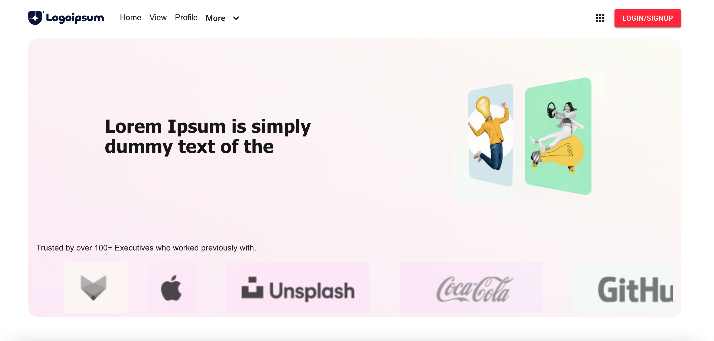
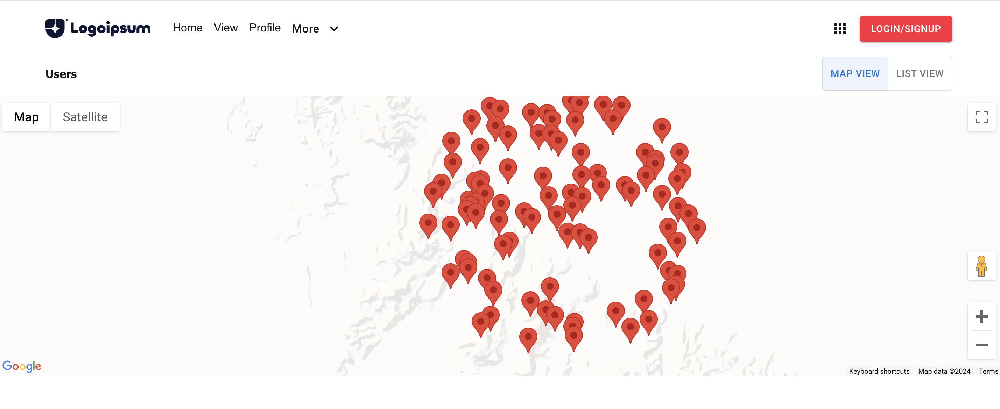
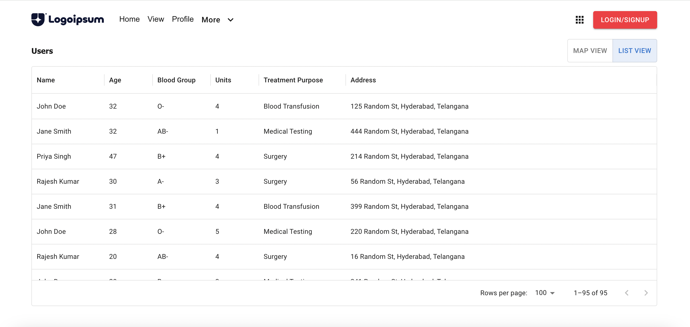
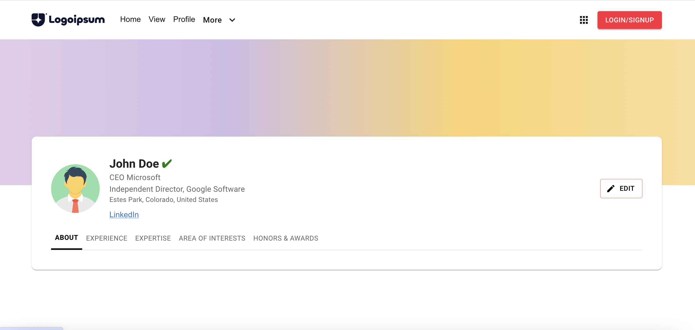

# Next XL

Next XL is a Next.js project with a variety of dependencies for building modern web applications. This project utilizes Material UI for design, Redux for state management, and integrates Google Maps with `@react-google-maps/api`.

## Getting Started

To get started with Next XL, follow these steps:

### Prerequisites

- Node.js (v18 or later)
- npm (v8 or later) or Yarn (v1.22 or later)

### Installation

1. Clone the repository:

   ```bash
   git clone <repository-url>
   cd next-xl

# Install dependencies:
 - npm install

# Start Development
 - npm run dev

# Build
- npm run build

# Start the production server
- npm run start
- Navigate to http://localhost:3000 to view the production build.

# Dependencies

  -  Next.js: A React framework for server-rendered or statically-exported React apps.
  -  Material UI: A popular React UI framework.
  - Redux: A state management library for JavaScript apps.
  -  React Google Maps: A library for integrating Google Maps with React.
  - Styled Components: A library for styling React components using tagged template literals.

# Dev Dependencies

  -  Autoprefixer: A PostCSS plugin to parse CSS and add vendor prefixes.
  -  PostCSS: A tool for transforming CSS with JavaScript plugins.
  -  Tailwind CSS: A utility-first CSS framework for building custom designs.


For more information, refer to the official Next.js documentation and the Material UI documentation.


Feel free to modify the sections according to your project’s specifics or any additional features and instructions.


# Home Screen



# View Page
- Map View


- List View



# Profile Page
